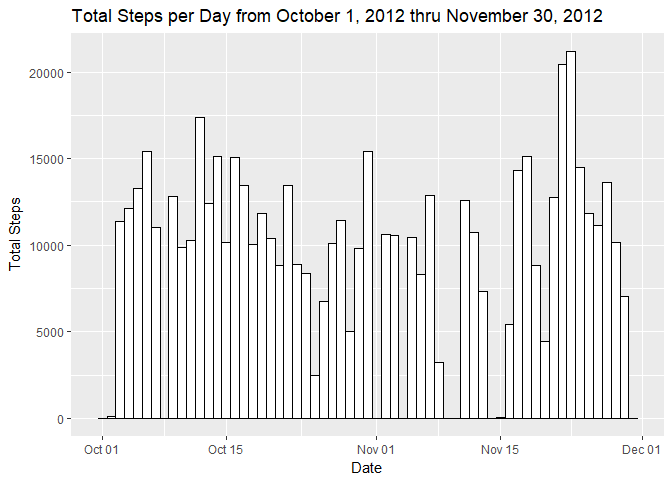
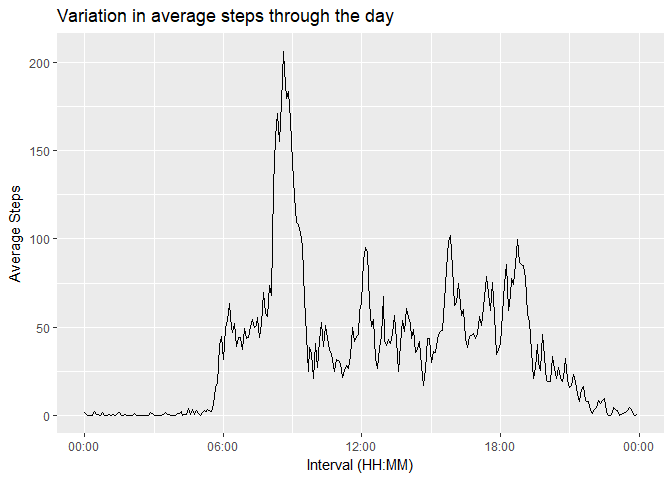
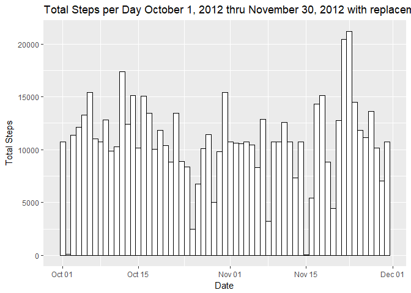
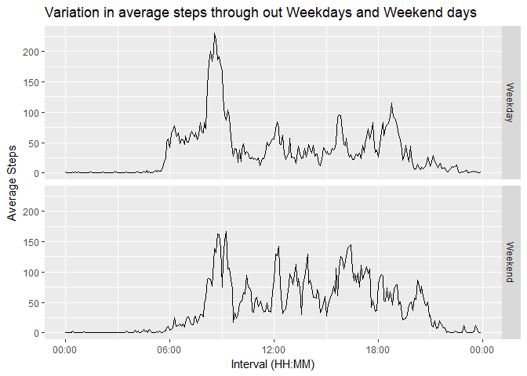

```r
knitr::opts_chunk$set(echo = TRUE)

library(plyr); library(dplyr); library(ggplot2); library(xtable); library(lubridate)
```

```
## Warning: package 'plyr' was built under R version 3.4.3
```

```
## Warning: package 'dplyr' was built under R version 3.4.3
```

```
## 
## Attaching package: 'dplyr'
```

```
## The following objects are masked from 'package:plyr':
## 
##     arrange, count, desc, failwith, id, mutate, rename, summarise,
##     summarize
```

```
## The following objects are masked from 'package:stats':
## 
##     filter, lag
```

```
## The following objects are masked from 'package:base':
## 
##     intersect, setdiff, setequal, union
```

```
## Warning: package 'ggplot2' was built under R version 3.4.3
```

```
## Warning: package 'lubridate' was built under R version 3.4.3
```

```
## 
## Attaching package: 'lubridate'
```

```
## The following object is masked from 'package:plyr':
## 
##     here
```

```
## The following object is masked from 'package:base':
## 
##     date
```

This assignment makes use of data from a personal activity monitoring device. This device collects data at 5 minute intervals through out the day. The data consists of two months of data from an anonymous individual collected during the months of October and November, 2012 and include the number of steps taken in 5 minute intervals each day.

## Loading and preprocessing the data

This code chunk will download and unzip the Activity Monitoring dataset. It will then load the data into an R object.

```r
fileUrl <- "https://d396qusza40orc.cloudfront.net/repdata%2Fdata%2Factivity.zip"
if(!file.exists("activity.zip"))download.file(fileUrl, "activity.zip")
if(!file.exists("activity.csv"))unzip("activity.zip")
if(!exists("activity"))activity <- read.csv("activity.csv")
```

The data is now contained in the object 'activity'. This is the structure of the data.

```r
str(activity)
```

```
## 'data.frame':	17568 obs. of  3 variables:
##  $ steps   : int  NA NA NA NA NA NA NA NA NA NA ...
##  $ date    : Factor w/ 61 levels "2012-10-01","2012-10-02",..: 1 1 1 1 1 1 1 1 1 1 ...
##  $ interval: int  0 5 10 15 20 25 30 35 40 45 ...
```

```r
unique(activity$interval)
```

```
##   [1]    0    5   10   15   20   25   30   35   40   45   50   55  100  105
##  [15]  110  115  120  125  130  135  140  145  150  155  200  205  210  215
##  [29]  220  225  230  235  240  245  250  255  300  305  310  315  320  325
##  [43]  330  335  340  345  350  355  400  405  410  415  420  425  430  435
##  [57]  440  445  450  455  500  505  510  515  520  525  530  535  540  545
##  [71]  550  555  600  605  610  615  620  625  630  635  640  645  650  655
##  [85]  700  705  710  715  720  725  730  735  740  745  750  755  800  805
##  [99]  810  815  820  825  830  835  840  845  850  855  900  905  910  915
## [113]  920  925  930  935  940  945  950  955 1000 1005 1010 1015 1020 1025
## [127] 1030 1035 1040 1045 1050 1055 1100 1105 1110 1115 1120 1125 1130 1135
## [141] 1140 1145 1150 1155 1200 1205 1210 1215 1220 1225 1230 1235 1240 1245
## [155] 1250 1255 1300 1305 1310 1315 1320 1325 1330 1335 1340 1345 1350 1355
## [169] 1400 1405 1410 1415 1420 1425 1430 1435 1440 1445 1450 1455 1500 1505
## [183] 1510 1515 1520 1525 1530 1535 1540 1545 1550 1555 1600 1605 1610 1615
## [197] 1620 1625 1630 1635 1640 1645 1650 1655 1700 1705 1710 1715 1720 1725
## [211] 1730 1735 1740 1745 1750 1755 1800 1805 1810 1815 1820 1825 1830 1835
## [225] 1840 1845 1850 1855 1900 1905 1910 1915 1920 1925 1930 1935 1940 1945
## [239] 1950 1955 2000 2005 2010 2015 2020 2025 2030 2035 2040 2045 2050 2055
## [253] 2100 2105 2110 2115 2120 2125 2130 2135 2140 2145 2150 2155 2200 2205
## [267] 2210 2215 2220 2225 2230 2235 2240 2245 2250 2255 2300 2305 2310 2315
## [281] 2320 2325 2330 2335 2340 2345 2350 2355
```

The data contains the total number of steps taken by an individual during the Months of October and November, 2012, and is broken down into 5 minute intervals. The intervals are broken down by hour. We The next code chunk will reformat the interval to four digits, the first two digits identify the hours (00 to 23) and the second two digits identify the minutes (00, 05, 10 ... 55) . It will then change the interval to a time format (HH:MM). The dates are currently coded as a factor list, so the code will reformat this as a date. 


```r
activity2 <- activity

activity2 <- mutate(activity2, interval2 = "")
activity2$interval2 <- mapply(function(x,y) paste0(rep(x,y), collapse = ""),0,4 - nchar(activity2$interval))
activity2$interval2 <- paste0(activity2$interval2, activity2$interval)
activity2$interval2 <- format(strptime(activity2$interval2, format = "%H%M"), format = "%H:%M")

activity2$date <- as.Date(activity2$date)
```

## What is mean total number of steps taken per day?

This histogram shows the total number of steps per day for the two month period. 


```r
activity2 <- group_by(activity2, date)
StepsPerDay <- summarise(activity2, total = sum(steps, na.rm = TRUE))
g <- ggplot(StepsPerDay, aes(date, weight = total))
g + geom_histogram(bins = 61, fill = "white", color = "black") + labs(y ="Total Steps", x ="Date", title = "Total Steps per Day from October 1, 2012 thru November 30, 2012")
```

<!-- -->
  
This table gives the mean and median of the total steps per day across the two month period.

```r
xt <- xtable(summarise(StepsPerDay, Average = mean(total), Median = median(total)), caption = "Step per Day")
print(xt, type = "html")
```

<!-- html table generated in R 3.4.2 by xtable 1.8-2 package -->
<!-- Wed Feb 28 20:45:36 2018 -->
<table border=1>
<caption align="bottom"> Step per Day </caption>
<tr> <th>  </th> <th> Average </th> <th> Median </th>  </tr>
  <tr> <td align="right"> 1 </td> <td align="right"> 9354.23 </td> <td align="right"> 10395 </td> </tr>
   </table>


## What is the average daily activity pattern?

This plot shows the average(across the two month time period) steps per 5 minute interval.

```r
StepsPerInterval <- summarise(group_by(activity2, interval2, interval), average = mean(steps, na.rm = TRUE))
with(StepsPerInterval, interval2 <- as.factor(interval2))
StepsPerInterval$interval2 <- as.POSIXct(StepsPerInterval$interval2, format="%H:%M")
g <- ggplot(data =StepsPerInterval, aes(x=interval2, y=average))
g + geom_line(group = 1) + scale_x_datetime(date_labels = "%H:%M") + labs(x = "Interval (HH:MM)", y = "Average Steps", title = "Variation in average steps through the day")
```

<!-- -->

```r
for(i in 1:nrow(StepsPerInterval)){
     if(StepsPerInterval$average[i] == max(StepsPerInterval$average)){
     maxInterval <- StepsPerInterval$interval[i]
}}
```
The interval with the max average number of steps is 835  


## Imputing missing values


```r
## figure out where the na's occur Are the individual intervals, or complete days of missing values?
missingData <- sum(is.na(activity2$steps))
```
Note that there 2304 intervals where there are missing values (coded as NA).

```r
sumImDa <- summarise(activity2, sumna = sum(is.na(steps)))
uniqueSum <- unique(sumImDa$sumna)
```
Broken down by date, there 2 unique values for the number of missing intervals: 288, 0. Since there are 288 intervals per day, the missing values represent complete days and not individual or small groups of intervals.The presence of missing days may introduce bias into some calculations or summaries of the data. Therefore, we will replace the missing values with the average total number of steps for the interval.


```r
activity3 <- group_by(activity2, interval)
sumtab <- summarise(activity3, average = mean(steps, na.rm = TRUE))
activity3 <- merge(activity3, sumtab, by = "interval")
for(i in 1:nrow(activity3)){
     if(is.na(activity3$steps[i])){
              activity3$steps[i]<- activity3$average[i]
          }
}

activity3 <- group_by(activity3, date)
StepsPerDay2 <- summarise(activity3, total = sum(steps, na.rm = TRUE))
f <- ggplot(StepsPerDay2, aes(date, weight = total))
f + geom_histogram(bins = 61, fill = "white", color = "black") + labs(y ="Total Steps", x ="Date", title = "Total Steps per Day October 1, 2012 thru November 30, 2012 with replacement of NAs")
```

<!-- -->

This table gives the mean and median of the total steps per day across the two month period.


```r
xt <- xtable(summarise(StepsPerDay2, Average = mean(total), Median = median(total)), caption = "Step per Day")
print(xt, type = "html")
```

<!-- html table generated in R 3.4.2 by xtable 1.8-2 package -->
<!-- Wed Feb 28 20:45:48 2018 -->
<table border=1>
<caption align="bottom"> Step per Day </caption>
<tr> <th>  </th> <th> Average </th> <th> Median </th>  </tr>
  <tr> <td align="right"> 1 </td> <td align="right"> 10766.19 </td> <td align="right"> 10766.19 </td> </tr>
   </table>
By replacing the missing values with the average for the individual intervals, the mean and median are now the same.


## Are there differences in activity patterns between weekdays and weekends?

Here we average across the weekdays and across the weekends to look for differences in activity patterns.

```r
activity3 <- mutate(activity3, DayOfTheWeek = weekdays(date))
activity3 <- mutate(activity3, weekday_end = "")
for(i in 1:nrow(activity3)){
     if(activity3$DayOfTheWeek[i] == "Saturday" |activity3$DayOfTheWeek[i] == "Sunday"){
     activity3$weekday_end[i] ='Weekend'
}else {
     activity3$weekday_end[i] ='Weekday'
}
}
SummWeekDayEnd <- summarise(group_by(activity3, weekday_end, interval2, interval), average = mean(steps, na.rm = TRUE))
with(SummWeekDayEnd, interval2 <- as.factor(interval2))
SummWeekDayEnd$interval2 <- as.POSIXct(SummWeekDayEnd$interval2, format="%H:%M")
h <- ggplot(data =SummWeekDayEnd, aes(x=interval2, y=average))
h + geom_line(group = 1) + scale_x_datetime(date_labels = "%H:%M") + labs(x = "Interval (HH:MM)", y = "Average Steps", title = "Variation in average steps through out Weekdays and Weekend days") + facet_grid(SummWeekDayEnd$weekday_end~.)
```

<!-- -->


